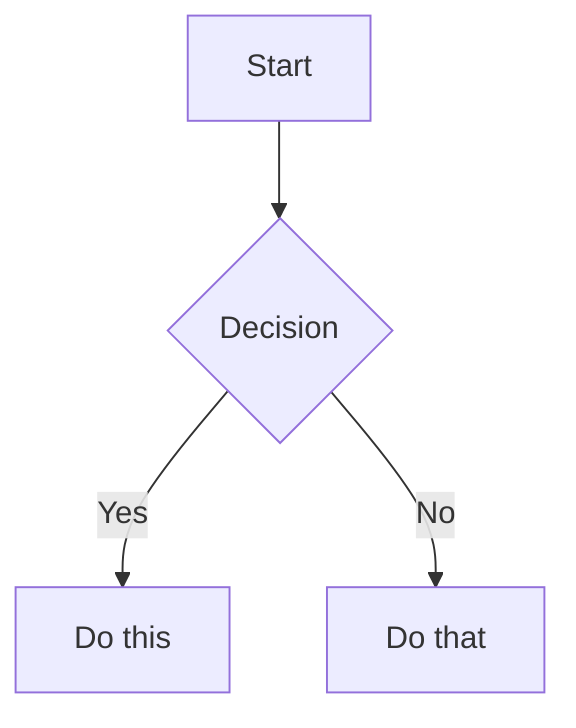

# Obsidian Flavored Markdown Reference

Obsidian extends CommonMark and GFM with callouts, embeds, highlights, comments, block IDs, and other syntax. This reference covers only Obsidian-specific extensions — standard Markdown (headings, bold, italic, lists, quotes, code blocks, tables) is assumed knowledge.

> **Link policy:** Use standard markdown links `[Title](./path.md)` — never wikilinks. This ensures compatibility with non-Obsidian tools.

## Callouts

```markdown
> [!note]
> Basic callout.

> [!warning] Custom Title
> Callout with a custom title.

> [!faq]- Collapsed by default
> Foldable callout (- collapsed, + expanded).

> [!question] Outer callout
> > [!note] Inner callout
> > Nested content
```

### Callout Types

| Type | Aliases | Color / Icon |
|------|---------|-------------|
| `note` | - | Blue, pencil |
| `abstract` | `summary`, `tldr` | Teal, clipboard |
| `info` | - | Blue, info |
| `todo` | - | Blue, checkbox |
| `tip` | `hint`, `important` | Cyan, flame |
| `success` | `check`, `done` | Green, checkmark |
| `question` | `help`, `faq` | Yellow, question mark |
| `warning` | `caution`, `attention` | Orange, warning |
| `failure` | `fail`, `missing` | Red, X |
| `danger` | `error` | Red, zap |
| `bug` | - | Red, bug |
| `example` | - | Purple, list |
| `quote` | `cite` | Gray, quote |

### When to Use Callouts in Vault Documents

| Callout | Use for |
|---------|---------|
| `[!warning]` | Compliance deadlines, security alerts, breaking changes |
| `[!important]` | Key decisions, mandatory actions |
| `[!info]` | Context that helps understanding but isn't critical |
| `[!example]` | Usage examples, reference implementations |
| `[!todo]` | Open items embedded in documents |
| `[!quote]` | Stakeholder quotes, customer feedback, requirements |
| `[!bug]` | Known issues, failure modes |
| `[!success]` | Completed milestones, verified items |

## Embeds (Standard Markdown)

Embed content from other vault files using standard markdown image syntax:

```markdown
              Embed full note
          Embed section
                    Embed image
           Embed image with alt text
                      Embed PDF page
                                Embed audio
```

### Image Sizing

Use HTML for explicit sizing (Obsidian renders it):

```markdown


```

### Embed Search Results

````markdown
```query
tag:#project status:done
```
````

## Block References

Define a block ID by appending `^block-id` to any paragraph:

```markdown
This paragraph can be referenced. ^my-block-id
```

For lists and quotes, place the block ID on a separate line after the block:

```markdown
> A quote block

^quote-id
```

Reference from another document: `[See this block](./document.md#^my-block-id)`

## Highlights

```markdown
==Highlighted text== renders with a yellow background.
```

## Comments

```markdown
This is visible %%but this is hidden%% text.

%%
This entire block is hidden in reading view.
Useful for internal notes, TODOs, or metadata that shouldn't render.
%%
```

## Math (LaTeX)

```markdown
Inline: $e^{i\pi} + 1 = 0$

Block:
$$
\frac{a}{b} = c
$$
```

## Diagrams (Mermaid)

````markdown

````

## Footnotes

```markdown
Text with a footnote[^1].

[^1]: Footnote content.

Inline footnote.^[This is inline.]
```

## Properties (Frontmatter)

```yaml
---
title: My Note
date: 2024-01-15
tags:
  - project
  - active
aliases:
  - Alternative Name
cssclasses:
  - custom-class
status: in-progress
rating: 4.5
completed: false
due: 2024-02-01T14:30:00
---
```

### Property Types

| Type | Example |
|------|---------|
| Text | `title: My Title` |
| Number | `rating: 4.5` |
| Checkbox | `completed: true` |
| Date | `date: 2024-01-15` |
| Date & Time | `due: 2024-01-15T14:30:00` |
| List | `tags: [one, two]` or YAML list |

### Default Properties

- `tags` — searchable labels, shown in graph view
- `aliases` — alternative names for the note (used in link suggestions)
- `cssclasses` — CSS classes applied in reading/editing view

### Tags

```markdown
#tag                    Inline tag
#nested/tag             Nested tag with hierarchy
#tag-with-dashes        Dashes allowed
#tag_with_underscores   Underscores allowed
```

Tags can contain: letters (any language), numbers (not first character), underscores, hyphens, forward slashes (for nesting).

## Complete Example

````markdown
---
title: Project Alpha
date: 2024-01-15
tags:
  - project
  - active
status: in-progress
---

# Project Alpha

This project aims to improve workflow using modern techniques. See [Workflow Design](./workflow-design.md) for details.

> [!important] Key Deadline
> The first milestone is due on ==January 30th==.

## Tasks

- [x] Initial planning
- [ ] Development phase
  - [ ] Backend implementation
  - [ ] Frontend design

## Notes

The algorithm uses $O(n \log n)$ sorting. See [Algorithm Notes](./algorithm-notes.md#Sorting) for details.


Reviewed in [Meeting Notes 2024-01-10](./meetings/2024-01-10.md#Decisions).

%%TODO: Add benchmarking results after next sprint%%
````

## References

- [Obsidian Flavored Markdown](https://help.obsidian.md/obsidian-flavored-markdown)
- [Callouts](https://help.obsidian.md/callouts)
- [Embed files](https://help.obsidian.md/embeds)
- [Properties](https://help.obsidian.md/properties)
